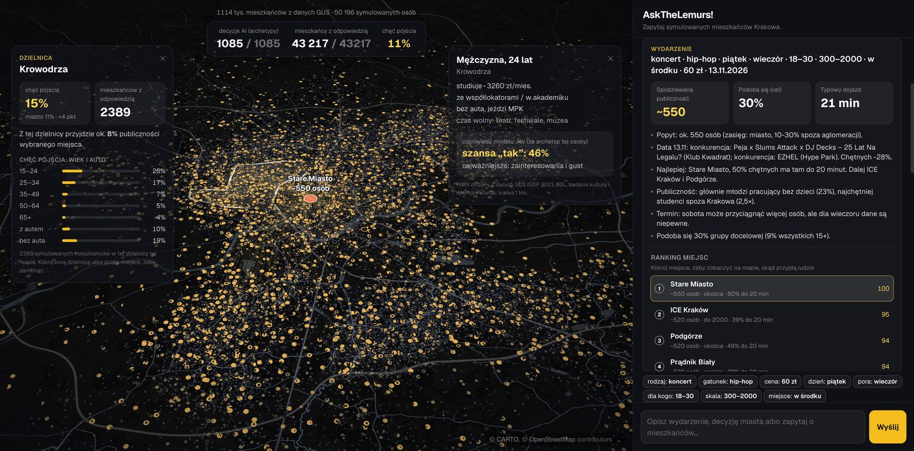
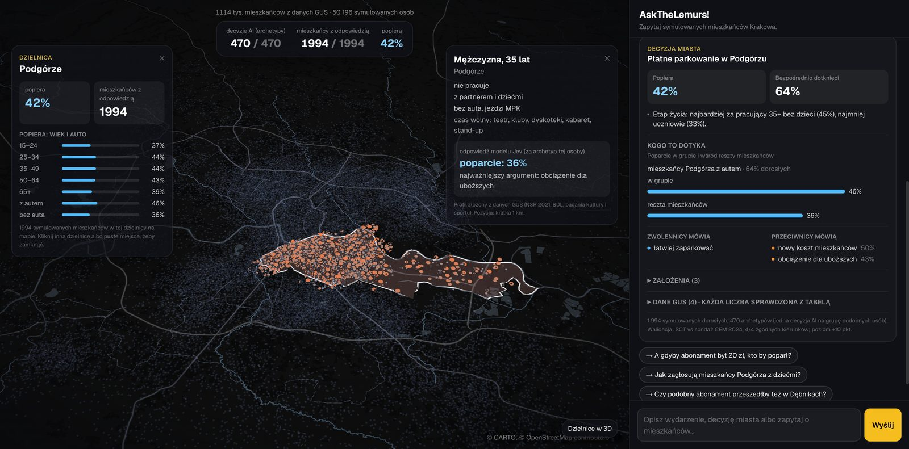

# AskTheLemurs!

**Ask a whole city before you decide.** A synthetic population of Kraków, built only from public data, that answers questions about events, city decisions and local businesses, and shows the answer on a live map.

Built at HackYeah 2026. Live demo: **https://web-production-14e60c.up.railway.app**



## What you can ask

Type a question in Polish. A router decides what kind of question it is and sends it down the right pipeline.

| Who asks | Example | What comes back |
|---|---|---|
| Event organiser | "Rap concert for students, 13 November, 60 zł, about 1 000 people" | Expected audience, venue ranking by real travel time, competing events that night, best day and time |
| District council | "Paid parking in Podgórze, 6 zł an hour, residents' pass 30 zł" | Support (42%), who is affected and how they vote (drivers 46% vs 36%), arguments for and against |
| City | "Night ban on alcohol sales in shops, 22–6" | Support by district, age, life stage and political leaning |
| Café owner | "Where are the most students per existing café?" | A data agent answers from census data and OpenStreetMap (Bronowice: 7 800 students, 4 cafés) |
| Journalist | "How do Nowa Huta and Krowodrza differ?" | Tables and charts from GUS, PKW and the simulated residents |

Click any dot to see the resident behind it. Click a district to see its own answer next to the city's.



## How it works

```
question (Polish)
   │
   ▼
router (gpt-5.4-mini) ──► event    ──► planner: slots, calendar and competing events (web search) ──┐
                     ├──► policy   ──► policy spec: who is affected, location, assumptions          ├──► Jev answers per archetype ──► code: travel times, totals ──► map + report
                     ├──► analyst  ──► data agent with tools over the normalised data               ┘
                     └──► off-topic ─► polite refusal
```

- **Residents.** 50 196 synthetic people (1 ≈ 22 real residents), each with a home in a 1 km census cell, age, sex, education, job, household, income, car, hobbies and a political leaning. Within ±0.7 points of the census on every checked indicator.
- **Decisions.** Jev (TypeSafe) is the decision model. Residents with the same decision-relevant traits form an archetype, and Jev answers once per archetype: about 1 000 calls cover the whole city.
- **Arithmetic stays in code.** Travel times come from the real MPK timetable (R5 routing over GTFS and OpenStreetMap), and day-of-week effects from HETUS. Totals are computed, never generated by a language model.
- **Grounding.** Every number in an agent's answer is matched against the tool results it came from. Unmatched numbers are flagged in the UI.

## Data

| Source | What it gives each resident |
|---|---|
| GUS census 2021 and BDL, 1 km grid | Home, age, sex, education, job, household, students |
| GUS culture and sport surveys | Concerts, theatre, cinema, sport and other habits |
| PKW, 454 precincts, and the 2023 Ipsos exit poll | Political leaning, matched to the vote in their neighbourhood |
| CEPiK car registry (via GUS) | Car ownership, fuel and age |
| MPK GTFS and OpenStreetMap (Geofabrik) | Door-to-door travel times; 20 000 shops and services |
| HETUS 2020, city safety survey, police reports | Day and time rhythms, perceived safety and crime by area |

All sources are public. Processed data is in `data/raw/` and `data/geo/`. The fetch scripts in `src/fetch_*.py` re-create it.

## Validation

| Test | Result |
|---|---|
| Clean Transport Zone, against a real CEM poll | 4 of 4 findings reproduced; support 59% vs 61% |
| Attendance at 13 real Kraków events | Median error 18–28% |
| Archetypes vs asking every resident | r = 0.93–0.98 (events), 0.88 by district (city decisions) |
| App test set (routing, facts, events) | 16 of 16 |
| Civic budget winners | **Fails** (Spearman 0.16): votes are won by mobilisation, which census data cannot see |

The limits are covered in [docs/CONTEXT.md](docs/CONTEXT.md), in Polish. Simulated residents are not a poll. Treat answers as a fast, cheap first estimate.

## Run locally

Requirements: Python 3.12, Node 20+ with pnpm, and API keys for OpenAI and TypeSafe (Jev). Tested on a fresh clone: about 2 minutes to a running app.

```bash
cp .env.example .env               # fill in OPENAI_API_KEY and TYPESAFE_API_KEY
pip install -r requirements.txt
make quick                         # builds out/ from the committed data in ~15 s
make app                           # API on http://localhost:8000
cd web && pnpm install && pnpm dev # app on http://localhost:3000 (second terminal)
```

`make quick` builds the residents, their political leaning and the heuristic event model. It skips the travel-time matrix, so travel times fall back to a distance formula. For real door-to-door times, run `make travel` once. It needs Java 21 and the optional packages in `requirements.txt`, downloads the MPK timetable and a 200 MB OpenStreetMap extract, and takes a while.

| Command | What it does |
|---|---|
| `make quick` | Residents, political leaning, heuristic model → `out/` |
| `make travel` | Door-to-door travel times (R5) → `out/travel_times.parquet` |
| `make data` / `make extra` | Re-fetch the source data (GUS needs `BDL_KEY`; PKW, OSM, HETUS, police) |
| `make app` / `make web` | API (FastAPI, SSE) / frontend (Next.js) |

The first run of a question costs about 6–15 ¢ in API calls. Repeat questions come from a cache in `out/`. A city decision is first restated by gpt-5.4 (who is affected, assumptions), and that wording varies between runs. The same question can land a few points apart: 54% on a fresh run against 58% in the demo for the night alcohol ban.

## Deploy

The repository deploys as two services. The API runs from the `Dockerfile`, which ships `out/` and the processed data, and reads keys from environment variables. The frontend is `web/`, with `NEXT_PUBLIC_API` set to the API URL. The API limits questions per IP and per day (`KS_LIMIT_IP`, `KS_LIMIT_DAY`) and allows the origins in `KS_ORIGINS`.

## Repository

| Path | Contents |
|---|---|
| `app/server.py` | FastAPI: chat, streamed runs, rate limit |
| `src/router.py`, `planner.py`, `policy.py`, `data_agent.py` | Router and the three pipelines |
| `src/jev_sim.py`, `archetypes*.py` | Resident state for Jev, archetypes and their checks |
| `src/personas.py`, `attitudes.py`, `travel_times.py` | Synthetic population, political leaning, travel times |
| `src/datastore.py`, `gus_facts.py` | Normalised data and grounded GUS facts |
| `src/fetch_*.py` | Data fetchers |
| `web/` | Next.js, deck.gl and MapLibre frontend |
| `viz/` | First prototype: a static map with a heuristic model |
| `docs/` | Project context, plan and screenshots |

## Credits

Inspired by *Generative Agent Simulations of 1,000 People* (Stanford), *Large Population Models / AgentTorch* (MIT Media Lab) and *AgentSociety* (Tsinghua). Exit-poll odds ratios: Cześnik, Szczupska and Sychowiec, *Polish Sociological Review* 2025.
