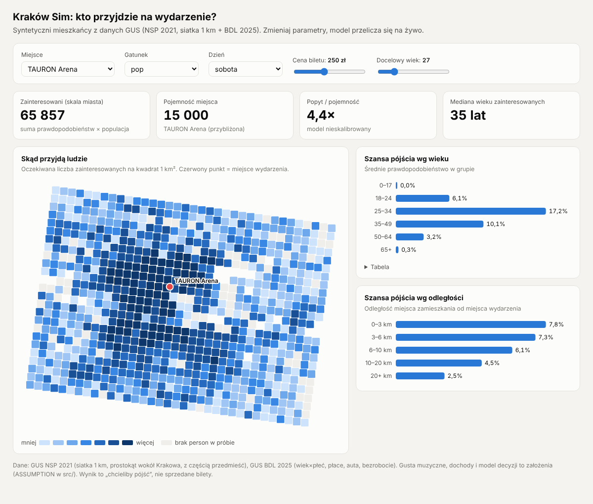

# Kraków Sim

**Pytanie:** gdybyśmy zrobili wydarzenie X w miejscu Y za cenę Z, kto z mieszkańców Krakowa by przyszedł i skąd?

Budujemy **syntetyczną populację Krakowa** z publicznych danych GUS: każdy „mieszkaniec” ma miejsce na siatce 1 km i dzielnicę, wiek, płeć, wykształcenie, zatrudnienie (kalibrowane per kwadrat), status, dochód (z rozkładu płac BDL), gospodarstwo domowe, auto oraz kulturę i sport losowane z badań ankietowych GUS. Dosypujemy studentów spoza Krakowa do łącznie 137 784 (BDL). Generator drukuje tabelę walidacji: model vs GUS. Potem **symulujemy jego decyzję** wobec scenariusza (koncert, nowa linia tramwajowa, podwyżka biletów…). Wynik: mapa ciepła „skąd przyjdą ludzie”, publiczność według dzielnic, **ranking „w której dzielnicy zrobić wydarzenie”**, rozkład wieku i dystansu, popyt vs pojemność.

Projekt na hackathon, inspirowany pracami o symulacji populacji agentami (Stanford: *Generative Agent Simulations of 1,000 People*, MIT Media Lab: *Large Population Models / AgentTorch*, Tsinghua: *AgentSociety*).



## Szybki start
```bash
pip install -r requirements.txt
make                 # persony (N=20000) -> symulacja -> viz/index.html
open viz/index.html  # mapa: kliknij, żeby postawić scenę; gatunek, dzień, cena, wiek, dojazd, studenci on/off
```
| Komenda | Co robi |
|---|---|
| `make app` + `make web` → http://localhost:3000 | **nowy front (Next.js, `web/`):** pełnoekranowa mapa Krakowa (deck.gl + MapLibre) z 20 tys. symulowanych mieszkańców; podczas symulacji każda kropka zmienia kolor w chwili, gdy Jev odpowiada za tę osobę; chętni lecą łukami do najlepszego miejsca; decyzje miasta: dzielnice rosną w 3D wg poparcia; klik w kropkę = profil i odpowiedź. API zostaje w FastAPI (`make app`, port 8000). Pierwsze `cd web && pnpm install`. |
| `make app` → http://localhost:8000 | **czat z mieszkańcami:** router rozpoznaje tryb. *Decyzja miasta* („jak przyjmą deptak na Karmelickiej?”): poparcie wg dzielnic, grup dotkniętych, argumenty. *Wydarzenie* („gdzie najlepiej zrobić X”): agent (Jev) wyciąga z wiadomości rodzaj, gatunek, dzień, porę, wiek, skalę, plener/halę, cenę i dopytuje o brakujące; potem Jev pyta 600–2500 mieszkańców, a ranking ~20 miejsc + dzielnic liczy się z czasu dojazdu. Mapa, ranking, wiek publiczności, powody |
| `make data` | pobiera świeże dane z GUS (BDL: 2 zapytania, klucz w `.env`; NSP: 1 plik ~23,5 MB) i granice dzielnic z OSM (1 zapytanie Overpass) |
| `make personas N=5000` | generuje persony → `out/personas.csv` |
| `make sim SCENARIO=scenarios/concert.json` | heurystyka (tylko wydarzenia): publiczność wg dzielnic, ranking „gdzie zrobić” |
| `make jev SCENARIO=scenarios/sct.json` | **główny model decyzji:** Jev (TypeSafe) pyta każdą personę 15+ osobno (~17 tys.), typowane pytania → skalibrowane prawdopodobieństwa, ~0,40 $ za scenariusz, kilka minut. Klucz `TYPESAFE_API_KEY` w `.env`; bez klucza dry-run |
| `make ask Q="Czy mieszkańcy poszliby na…?"` | **pytanie o cokolwiek:** Claude zamienia pytanie na typowany scenariusz (`schema.Custom`: 1–3 pytania Noul/Score/Choice, cena, miejsca), Jev odpowiada za każdą personę. Potrzebne `ANTHROPIC_API_KEY` + `TYPESAFE_API_KEY`; bez klucza Anthropic scenariusz pisze się ręcznie (przykład `scenarios/ask_kino_plenerowe.json`) |
| `make calibrate` | Jev odpowiada na pytania ankiety GUS (koncert/teatr/kino/klub w ostatnim roku) bez hobby w opisie → porównanie z GUS wg wieku×płci, ~0,20 $ |
| `make agents SCENARIO=scenarios/sct.json` | warstwa LLM: ~650 archetypów × paczki po 10 × Batch API, typowana odpowiedź (Pydantic), ~1 $ za pytanie. Klucz `ANTHROPIC_API_KEY` w `.env`; bez klucza: `python3 src/agents.py ... --dry-run` / `--mode manual` |
| `make viz` | buduje `viz/index.html` (samodzielny plik, bez serwera) |

Klucz BDL (darmowy, od ręki): https://bdl.stat.gov.pl/api/v1/client → zapisz w `.env` jako `BDL_KEY=...`. Dane z `make data` są już w repo (`data/raw/`), więc do pracy nad modelem/wizualizacją klucz nie jest potrzebny.

## Jak to działa (w skrócie)
```
GUS NSP 2021 siatka 1 km ─┐                      ┌─> src/simulate.py (heurystyka, wydarzenia) ─> out/sim_*.csv, district_ranking.csv
GUS BDL 2025 demografia   ├─> src/personas.py ──┼─> src/agents.py (Claude + schema.py, dowolny scenariusz) ─> out/llm/*
OSM dzielnice             ┘   (out/personas.csv) └─> viz/index.html (heurystyka przeportowana do JS)
```
Szczegóły: model decyzji, skąd dokładnie są dane, pułapki i decyzje → **[docs/CONTEXT.md](docs/CONTEXT.md)**.

## Struktura
| Ścieżka | Co to |
|---|---|
| `data/raw/krakow_demo.json` | BDL 2025: wiek×płeć (18 grup), płaca brutto, bezrobocie, auta/1000 |
| `data/raw/krakow_grid_nsp2021.json` | NSP 2021, 852 kwadraty 1 km wokół Krakowa |
| `data/geo/krakow_districts.geojson` | OSM: granice 18 dzielnic + granica miasta (uproszczone ~25 m) |
| `data/geo/units_geo.json` | centroidy (stare, nieużywane) |
| `src/fetch_*.py`, `src/parse_gus_surveys.py` | pobieranie danych (BDL, siatki spisowe, badania GUS, OSM) |
| `src/personas.py` | generator person z danych GUS + tabela walidacji |
| `src/bio.py` | kultura, sport, wydatki z badań ankietowych GUS |
| `src/simulate.py` | heurystyczny model decyzji (wydarzenia) |
| `src/schema.py` | typy Pydantic: `Persona`, `Scenario` (event / transit / policy), `Reaction` (enumy) |
| `app/server.py`, `app/static/index.html`, `src/router.py`, `src/planner.py`, `src/policy.py` | aplikacja: router trybów, planer wydarzeń, tryb decyzji miasta; (FastAPI + jedna strona HTML): czat, przebieg Jev z postępem (SSE), ranking miejsc |
| `src/ask.py` | pytanie po polsku → Claude (structured outputs) → `scenarios/ask_<slug>.json` → `jev_sim.py` |
| `src/jev_sim.py` | Jev: stan persony po angielsku + fakty liczone w kodzie (koszt biletu jako % dochodu, czas dojazdu, czy SCT zakazuje auta, dopłata do biletu) → Noul/Score/Choice |
| `src/agents.py` | warstwa LLM: archetypy, paczki, Batch API, structured outputs → `Packet`, agregacja wg dzielnic |
| `scenarios/*.json` | scenariusze: `concert` (event), `sct` (policy), `mpk_fare` (transit), `ask_*` (custom, dowolne pytania) |
| `viz/` | `template.html` + `build_map.py` → `index.html`; `venues.json` = miejsca |
| `docs/` | kontekst projektu, podgląd |
| `archive/` | stara wersja generatora (bez siatki) |
| `out/` | wyniki (git-ignored) |

## Status
✅ dane GUS pobrane i podpięte · ✅ persony na siatce 1 km · ✅ dzielnice + granica miasta · ✅ studenci spoza Krakowa · ✅ ranking dzielnic · ✅ heurystyczny model decyzji · ✅ interaktywna mapa (jasny/ciemny, mobile)
✅ warstwa LLM z typowanym wyjściem (dowolny scenariusz, nie tylko koncerty)
⬜ kalibracja · ⬜ LLM w wizualizacji · ⬜ agenci LLM · ⬜ demo/pitch → lista w [docs/CONTEXT.md#roadmapa](docs/CONTEXT.md#roadmapa)
